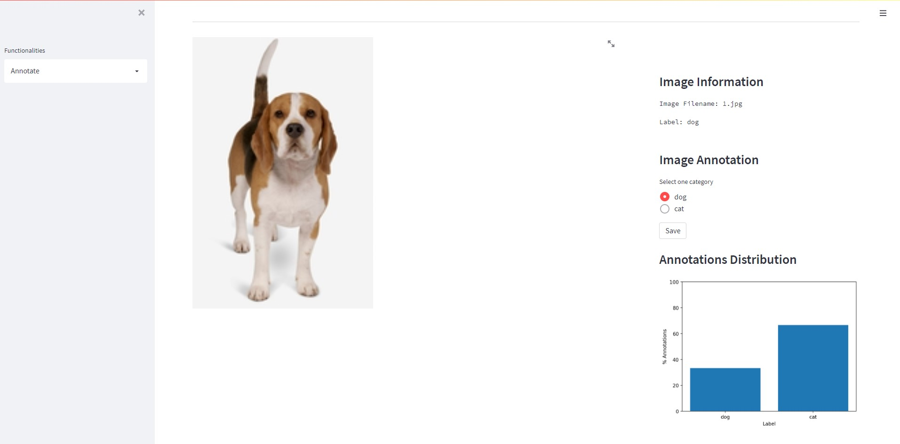

# **Annolit**

## *Annolit* is an annotation tool for CV tasks in Streamlit.

### **Usage** 

To use Annolit, first install the required packages from *requirements.txt*.

Then execute the following command:

```
streamlit run app.py
```

### **Annolit Workflow**

#### **1. Setup Project**
From the sidebar, go to the *Setup Project* page. Here you can:
* Open a project: from a list of old annotations projects you can select one.
<p align="center">
    </img>
</p>
    
* Create a project: you can create a new annotation project, specifying project name, dataset to use, and classification categories.
<p align="center">
    </img>
</p>

        
#### **2. Annotate**
From the sidebar, go to the *Annotate* page. Here you can start annotating each image in the dataset.
<p align="center">
    </img>
</p>
    
Every time you assing a label, an annotation.csv file is uploaded in the *projects/project_name* folder. Once you are done, this file represents the annotation file.

The annotations csv file will look like the following one:
<p align="center">
    </img>
</p>


----------
### **Warnings**
Be sure to have the images within the path *images/dataset_name/*.jpg*

### **To-Do**
[ ] Fix UI/UX transition from setup and annotation

[ ] Add support to Object Detection
    